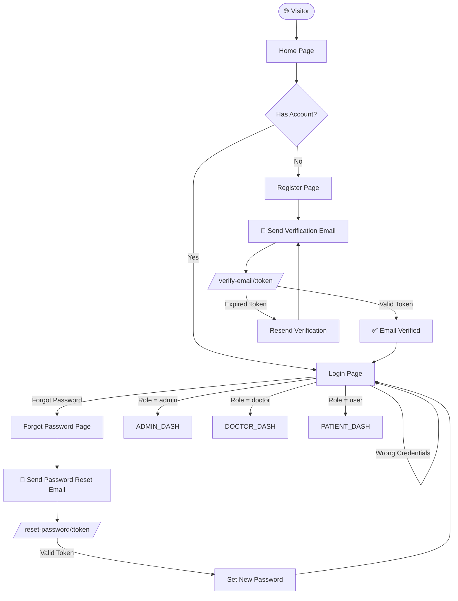
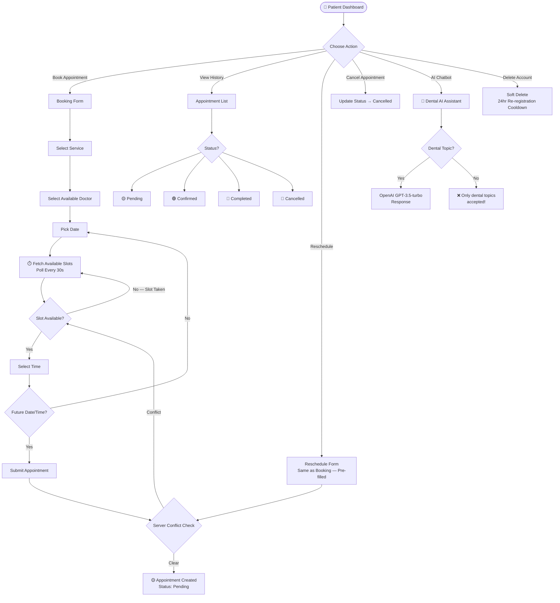
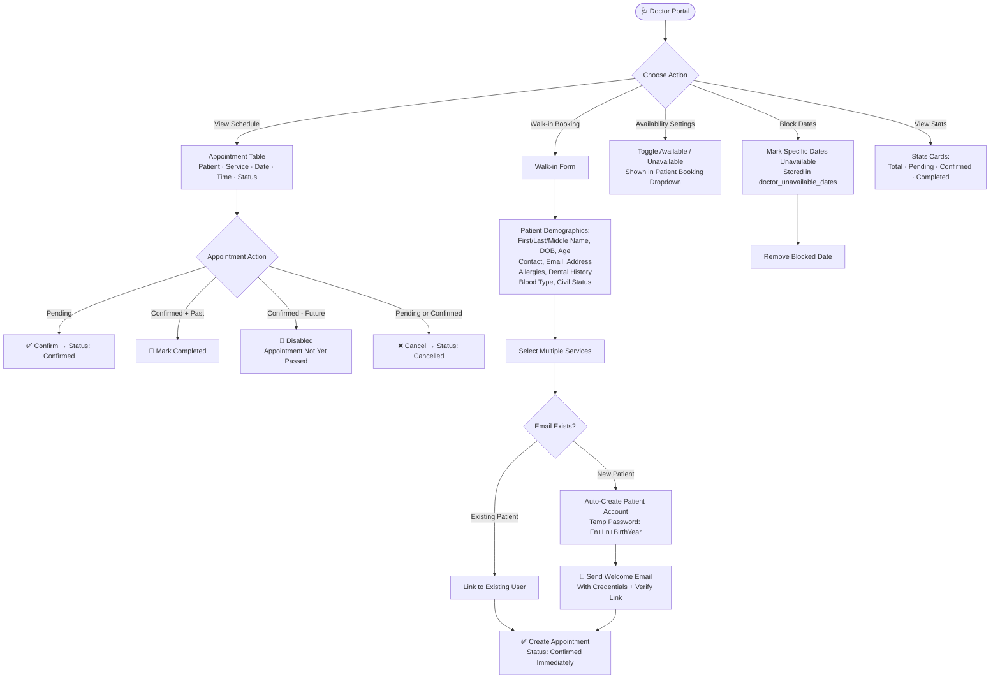
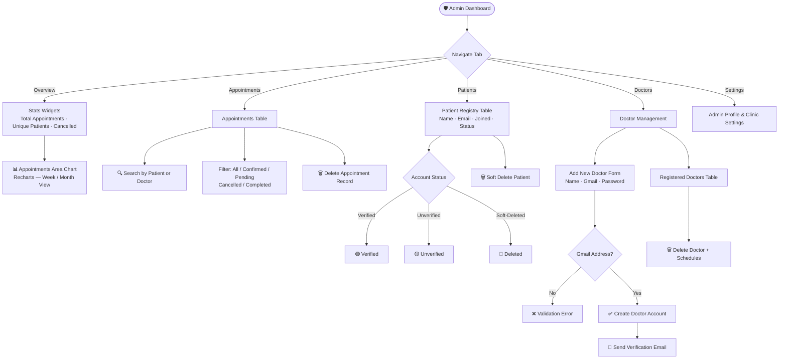
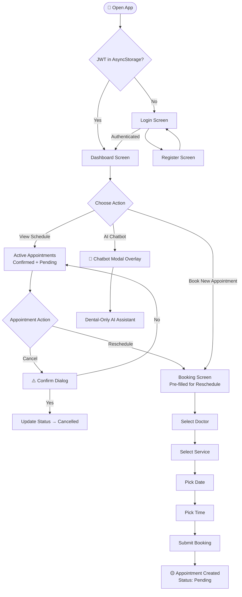
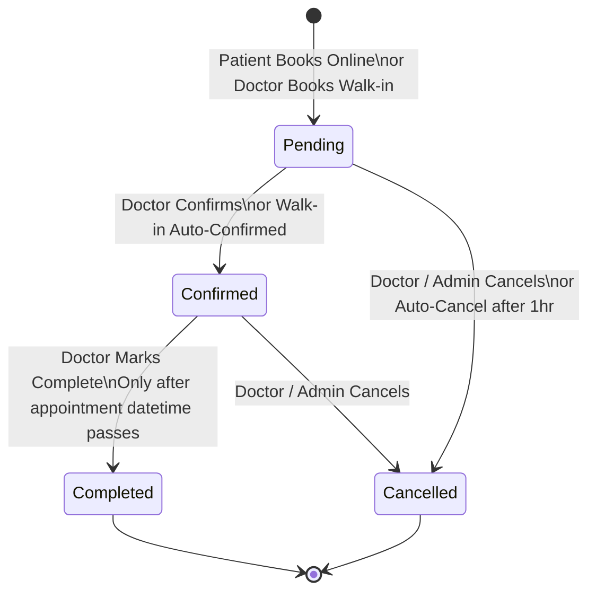
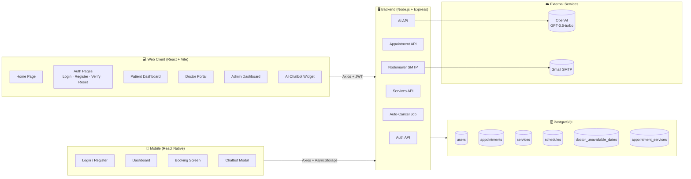

# 🦷 Dental Care Plus — System Flowchart

A comprehensive visual map of the full Dental Care Plus system, covering all three portals (Patient, Doctor, Admin), the mobile app, and key backend processes.

---

## 🗺️ Master System Flow



---

## 🧑 Patient Portal Flow (Web)



---

## 🩺 Doctor Portal Flow (Web)



---

## 🛡️ Admin Dashboard Flow (Web)



---

## 📱 Mobile App Flow (React Native / Android)



---

## ⚙️ Backend Automation Flow

```mermaid
flowchart TD
    SERVER_START([🚀 Server Start]) --> BOOTSTRAP[Bootstrap Admin\nCreate if not exists]
    SERVER_START --> AUTO_JOB[Start Auto-Cancellation Job]

    AUTO_JOB --> RUN_NOW[Run Immediately on Startup]
    RUN_NOW --> JOB_LOGIC{Pending Appointments\n> 1 hour old?}
    JOB_LOGIC -->|Yes| AUTO_CANCEL[Update Status → Cancelled\nLog Cancelled Count]
    JOB_LOGIC -->|No| WAIT[Wait 5 Minutes]
    WAIT --> JOB_LOGIC
    AUTO_CANCEL --> WAIT

    SERVER_START --> ROUTES[Register API Routes]
    ROUTES --> AUTH_ROUTE[/api/auth/*\nRegister, Login, Verify,\nForgotPw, ResetPw,\nDoctors, Patients,\nAvailability, Me]
    ROUTES --> APT_ROUTE[/api/appointments/*\nGet, Create, Update,\nStatus, Delete,\nBooked Slots, Walk-in]
    ROUTES --> AI_ROUTE[/api/ai/chat\nOpenAI Proxy — Dental Only]
    ROUTES --> SVC_ROUTE[/api/services\nGet All Services]
```

---

## 🔄 Appointment Lifecycle



---

## 🏗️ System Architecture


